# MHW Board Game Companion

A mobile-first **PWA** campaign tracker and character sheet for
**Monster Hunter World: The Board Game** (Ancient Forest & Wildspire Waste).

The fight stays on the table. The app takes over the bookkeeping *between*
hunts — hunters, materials, crafting, quest progress and downtime — and keeps it
in sync live across every player's phone.

<p align="center">
  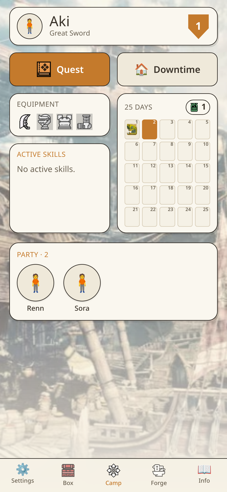
  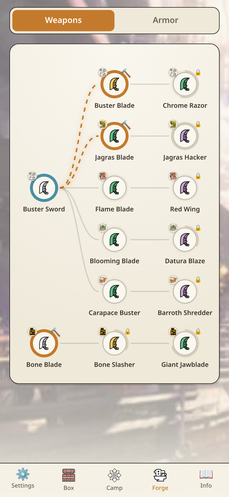
  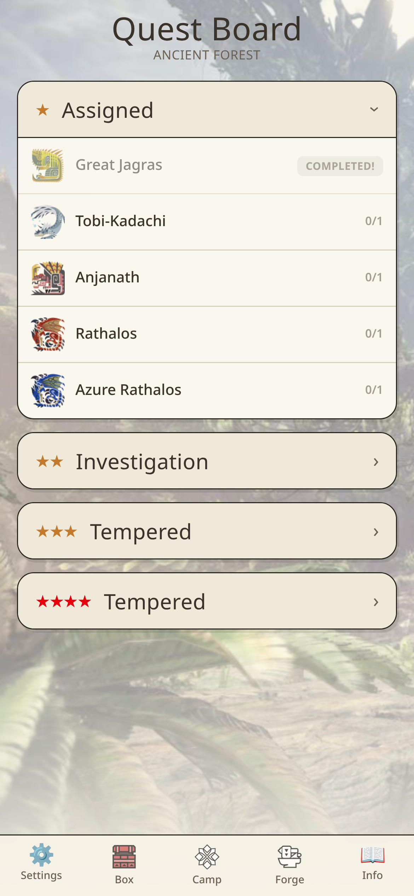
</p>

---

## What it does

### Camp — the hub


Your hunter at a glance: weapon, total defence, equipped gear and the skills
that gear grants. The calendar tracks the campaign timer day by day, showing
which monster was hunted on each — tap a day to re-read its loot report.

The party row shows your fellow hunters; tap one to propose a **material trade**.
The other player gets a badge, and accepts or declines on their own device.

<br clear="right">

### Quest board


Every quest from the boxes you own, grouped by star tier. Tiers unlock as the rulebook
dictates: an **Assigned** (1★) hunt opens the monster's **Investigation** (2★),
which opens its **Tempered** hunts (3★/4★). Locked rows say why, and each row
tracks how many times you have cleared it.

<br clear="right">

### The hunt

One player starts a quest and everyone else gets an invite popup. The flow
mirrors a real session:

| Phase | What happens |
| --- | --- |
| **Lobby** | Waiting room; the hunt only starts once every hunter is ready |
| **Investigation** | Each hunter logs what they gathered; only the starter closes the phase |
| **The fight** | Happens on the table. The app tracks potions and takes the outcome |
| **Looting** | Each hunter rolls their own 2d6, picks a die or the sum, and confirms |
| **Summary** | Party-wide reward recap, then the campaign day advances |

<p>
  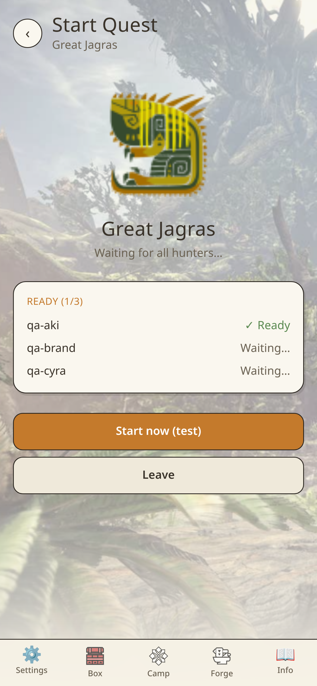
  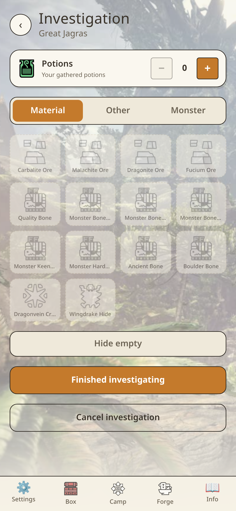
  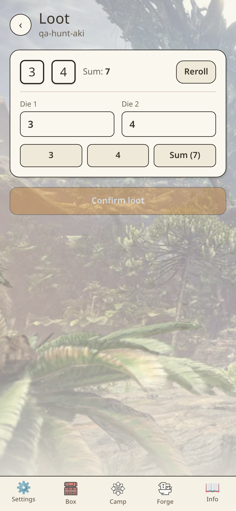
  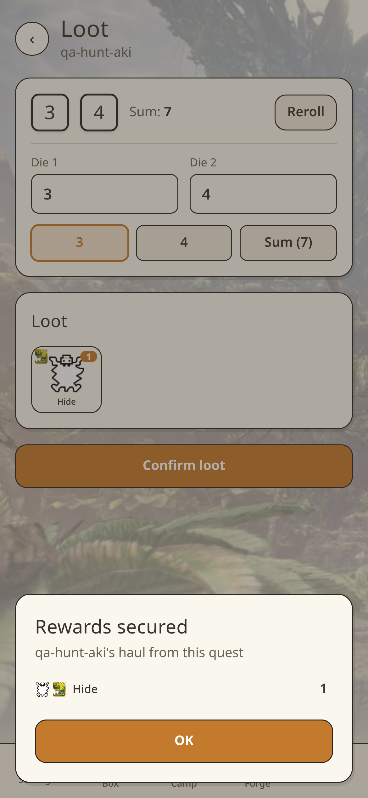
</p>

Failing a 1★ hunt lets you keep or abandon what you gathered; higher tiers cost
you the loot and a day.

### Forge


The full upgrade tree for your weapon type, drawn as a graph: what you own, what
you can afford right now, and what is still locked. Tap a node for its material
cost and the attack-deck changes it brings, then craft — materials are deducted
and the gear becomes equippable. Armour sets work the same way on their own tab.

<br clear="right">

### Box

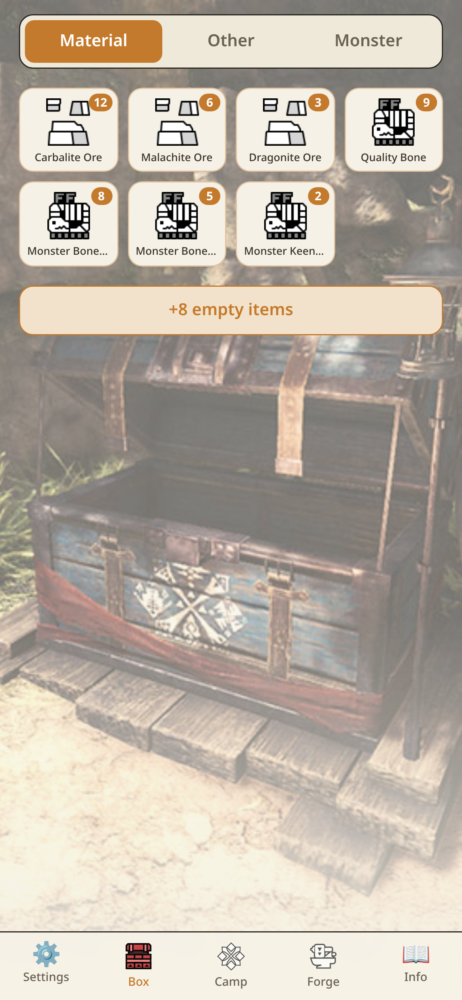

Your personal material stash, split into Material / Other / Monster parts. Every
material carries its icon, and monster parts are badged with the monster they
came from. Adjust quantities by hand whenever the table disagrees with the app.

<br clear="right">

### Downtime

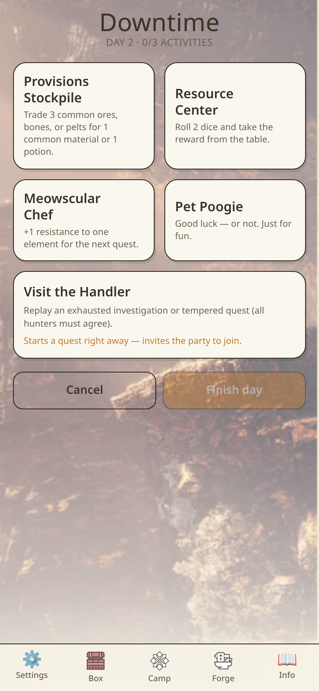

A shared rest day. Each hunter picks their activities — **Provisions Stockpile**,
**Resource Center**, **Meowscular Chef**, **Poogie**, or **the Handler** to
replay an exhausted hunt — resolves them, then confirms. The day advances only
once *every* hunter has confirmed.

<br clear="right">

### Hunter's Handbook

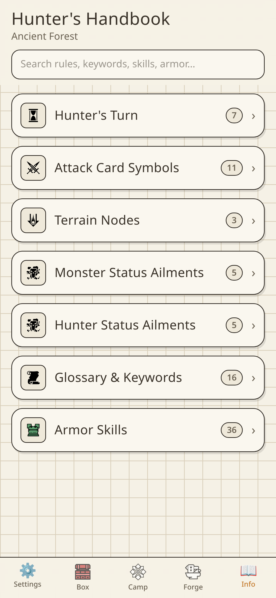

A searchable rules reference so the rulebook can stay in the box: turn order,
attack-card symbols, terrain nodes, status ailments for monsters and hunters, a
glossary of the terms the character sheet assumes, and every armour skill.

<br clear="right">

---

## Multiplayer

Everyone plays in one shared campaign, joined with an 8-character code.

- **One weapon per hunter** — the picker greys out weapons teammates have claimed
- **Live sync** — a change on one phone shows up on the others without a reload
- **Quest invites** — start a hunt and the party is invited wherever they are
- **Trading** — propose, accept or decline material trades between hunters
- **Shared resources** — party potion stockpile, campaign day, and calendar

Sign-in is a **hunter name and password** — no email needed. (Under the hood the
name is mapped to a synthetic address for Supabase Auth.)

<p>
  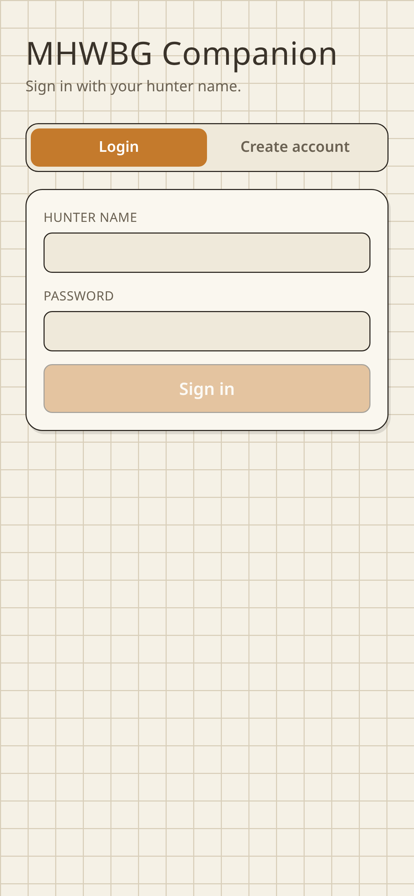
  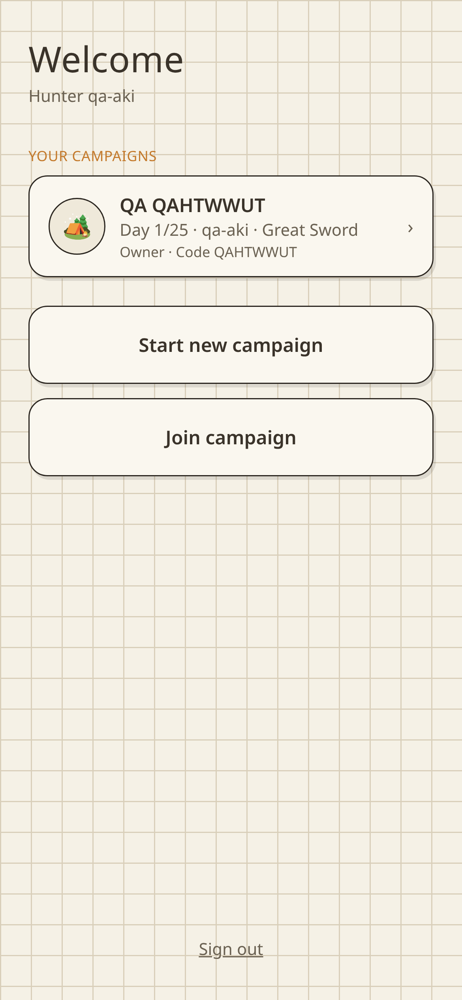
  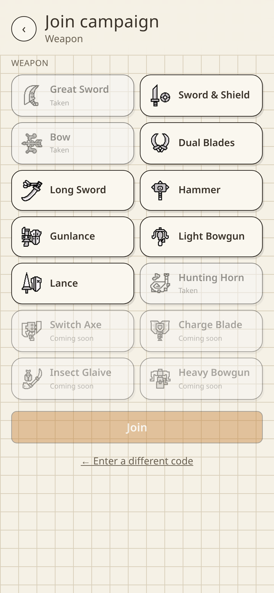
</p>

---

## Content

| | |
| --- | --- |
| Monsters | 10 |
| Quests | 30 |
| Loot tables | 10 |
| Weapon types | 10 (4 core + 6 from Hunter's Arsenal) |
| Weapon forge paths | 48 |
| Armour sets | 7 |
| Gear items | 149 |
| Materials | 93 |

**Ancient Forest** — Great Jagras, Tobi-Kadachi, Anjanath, Rathalos, Azure Rathalos.
**Wildspire Waste** — Barroth, Pukei-Pukei, Jyuratodus, Diablos, Black Diablos.

Not yet included: Kirin, the Picking Bones monsters (Tzitzi-Ya-Ku, Great Girros,
Radobaan), and the elder dragons (Kushala Daora, Nergigante, Teostra). What is
still needed for each is tracked in **[docs/qa/missing-data.pdf](docs/qa/missing-data.pdf)**;
sourced data lives in [docs/research/mhwbg-content-dossier.md](docs/research/mhwbg-content-dossier.md).

### Choosing your boxes

Tick the boxes your group actually owns when you create a campaign, or later
under **Settings → Boxes**. The quest board and the weapon picker then offer only
what you own — a group with just Ancient Forest never sees Barroth or a Hunting
Horn. Adding Wildspire Waste also adds 20 days to the campaign timer, as the
rulebook requires.

Unticking a box is safe mid-campaign: it only changes what is *offered*.
Materials and gear a hunter already owns are never removed, and the app refuses
the change if a hunter would lose the weapon they are playing.

<p align="center">
  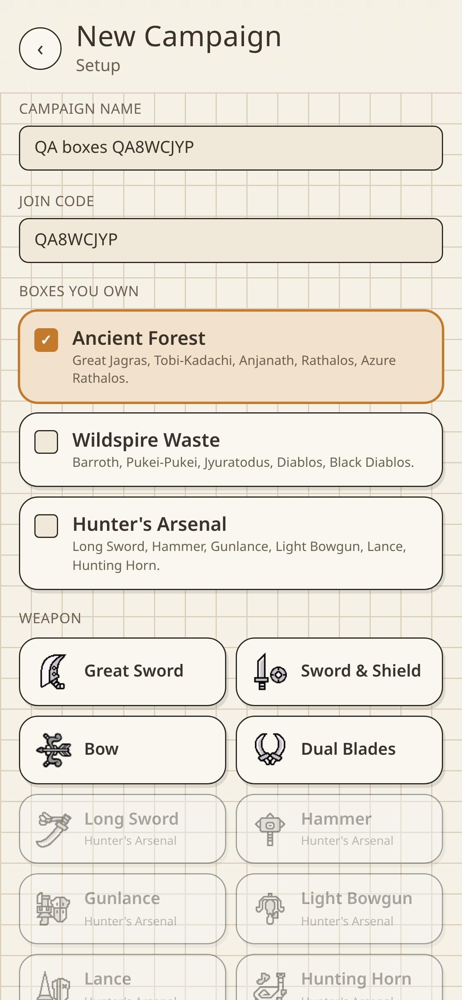
</p>

---

## Running it

```bash
npm install
cp .env.example .env      # then fill in your Supabase project values
npm run dev
```

Environment variables use the **`SUPABASE_`** prefix, not Vite's usual `VITE_`
(see `envPrefix` in `vite.config.ts`):

```
SUPABASE_URL=https://<project-ref>.supabase.co
SUPABASE_ANON_KEY=<anon key>
```

**Supabase setup:** run [`supabase/schema.sql`](supabase/schema.sql) in the SQL
editor. It is idempotent, so it is also how you apply later migrations. Enable
the **Email** auth provider and turn *off* email confirmation — hunter names map
to `<name>@mhwbg.local`, which is not a deliverable domain.

**The app is online-only.** Despite the local-first storage layer, the shell
blocks until Supabase sync is live, so a campaign needs connectivity to play.

### Commands

| Command | What it does |
| --- | --- |
| `npm run dev` | Vite dev server |
| `npm run build` | Type-check and build the PWA bundle |
| `npm run lint` | `tsc -b --noEmit` (there is no ESLint) |
| `npm run test:domain` | Pure domain-rule tests |
| `npm run test:e2e` | Playwright end-to-end suite |
| `npm run report:research` | Regenerate the content dossier |
| `npm run report:missing` | Regenerate the missing-data report + PDF |

### Testing

The E2E suite drives **three real accounts in parallel browser contexts** against
a running app, asserting both the UI and the Postgres rows behind it — that is
how the co-op surface (lobby, invites, per-hunter loot, trading) is covered.

```bash
# against a local dev server
npm run dev
E2E_BASE_URL=http://localhost:5173 E2E_SHARE_TOKEN= npm run test:e2e

# against a deployment protected by Vercel SSO
E2E_SHARE_TOKEN=<_vercel_share token> npm run test:e2e
```

The README screenshots are produced by `tests/e2e/screenshots.spec.ts`, using the
same fixtures and viewport as the tests, so they cannot drift from the app.

Findings and known issues: **[docs/qa/e2e-report.md](docs/qa/e2e-report.md)**.

---

## Tech

| Area | Choice |
| --- | --- |
| Framework | React 18 + Vite + TypeScript |
| Styling | Tailwind CSS v4 |
| State | Zustand (persisted to `localStorage`) |
| Backend | Supabase — Postgres, Auth, Realtime, RLS |
| PWA | `vite-plugin-pwa` |
| Testing | Playwright + `node:assert` domain tests |
| Hosting | Vercel |

Architecture notes for contributors are in [CLAUDE.md](CLAUDE.md).

---

## Credits

*Monster Hunter World: The Board Game* is published by **Steamforged Games**;
Monster Hunter is © **CAPCOM**. This is an unofficial fan-made tool with no
affiliation to either.

- Material, weapon and monster icons come from [`reDBo0n/mhwbg-comp`](https://github.com/reDBo0n/mhwbg-comp)
  (code GPL-3.0; the icons themselves are CAPCOM property and fall outside that licence).
- Quest, physiology and reward-table data from [`Elvaron/MHW-BG-QuestCards`](https://github.com/Elvaron/MHW-BG-QuestCards) (CC0-1.0),
  vendored under `docs/research/data/` with its licence.
